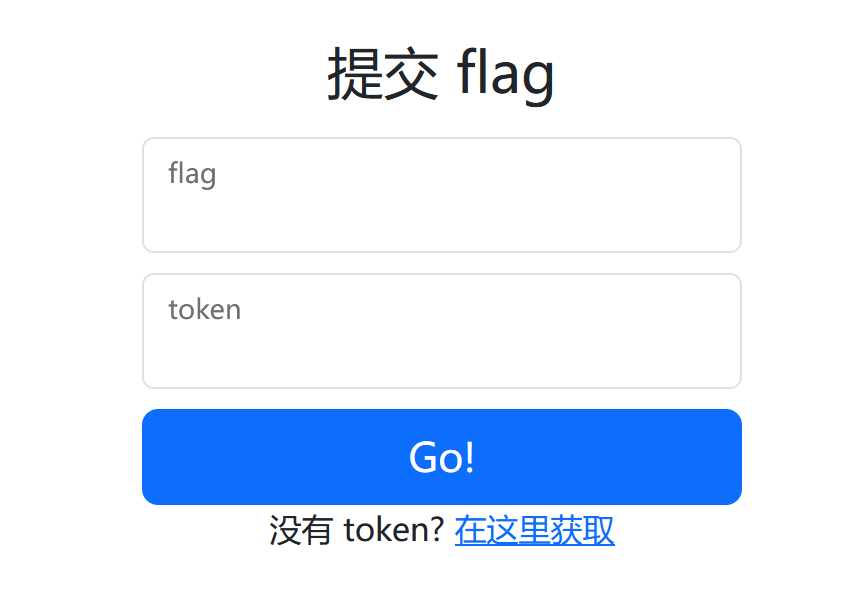
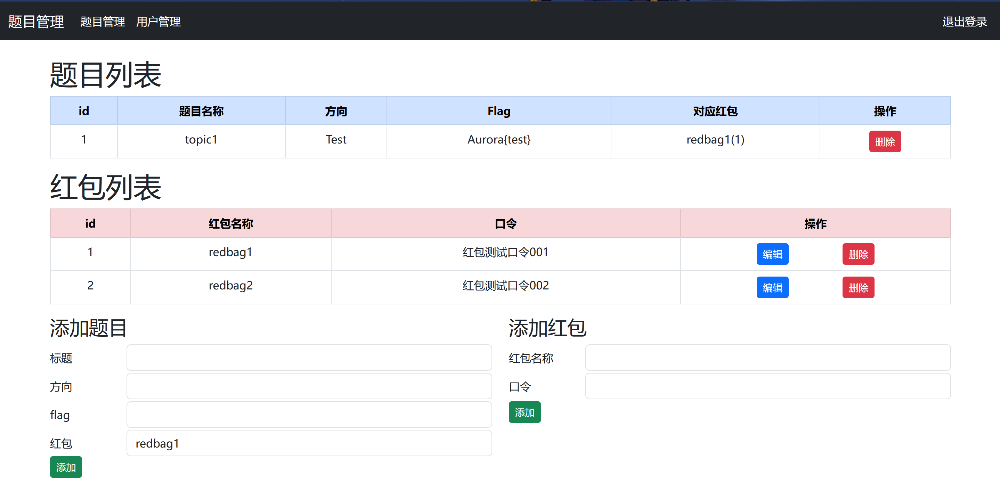

# redbag_platform

给 Aurora 红包题随便搓的 flag 提交平台

启动前请修改 `src/config.json` 中的 `default_user` 默认账密

## 说明

`/flag` 页面用于选手提交 flag, 当 flag 正确时显示对应的红包口令

`/admin` 是管理员页面, 实现了管理红包和题目的功能

`/admin/login` 是管理员登录接口

